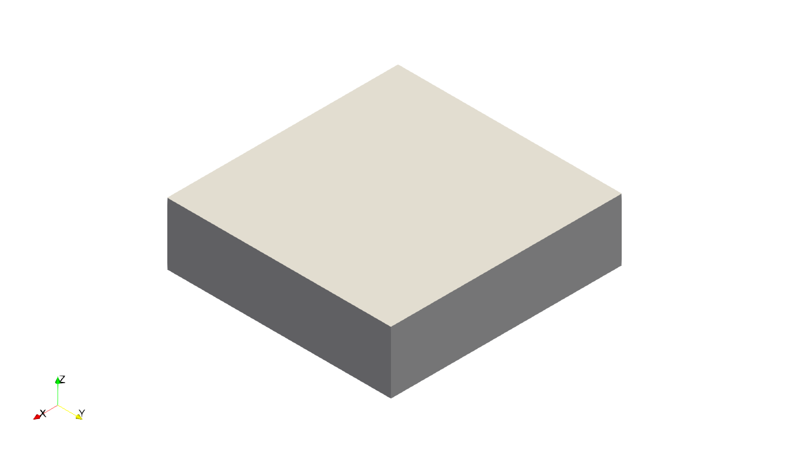
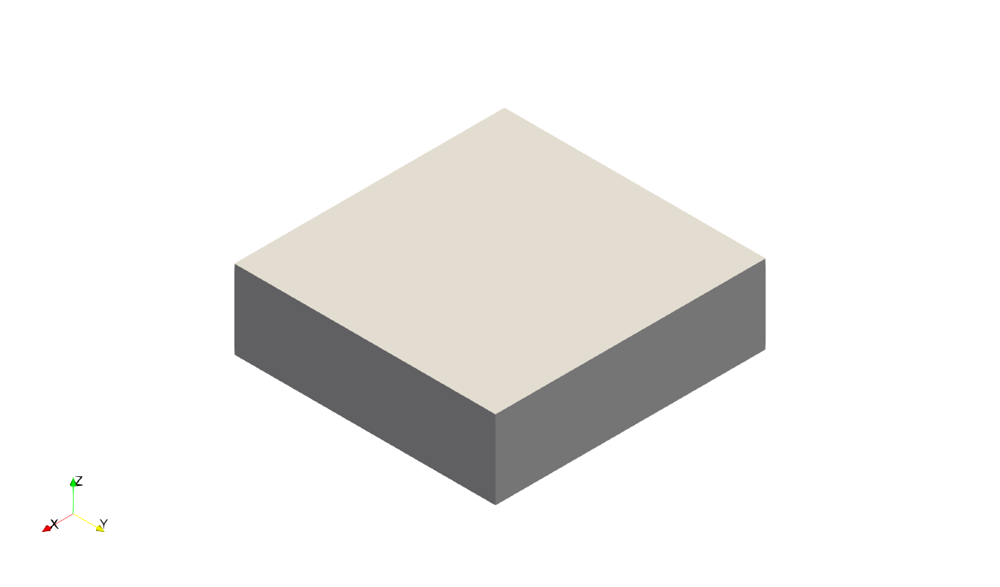
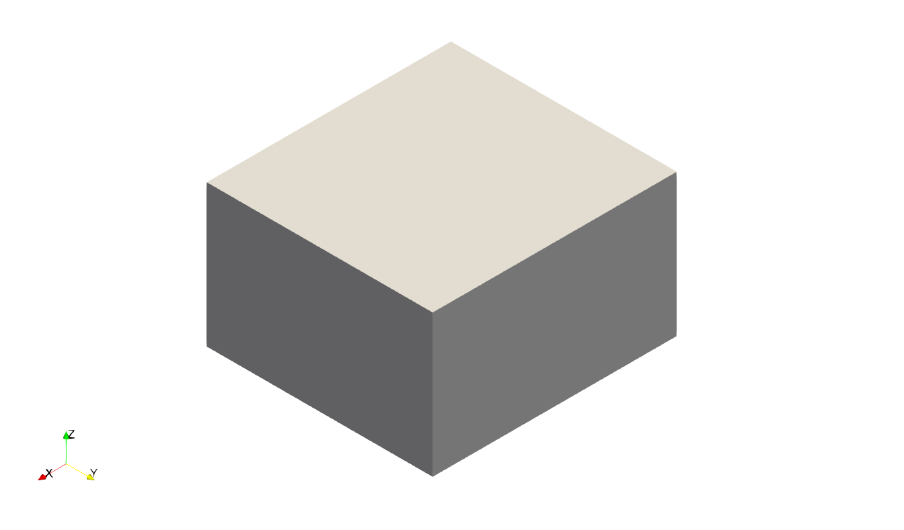
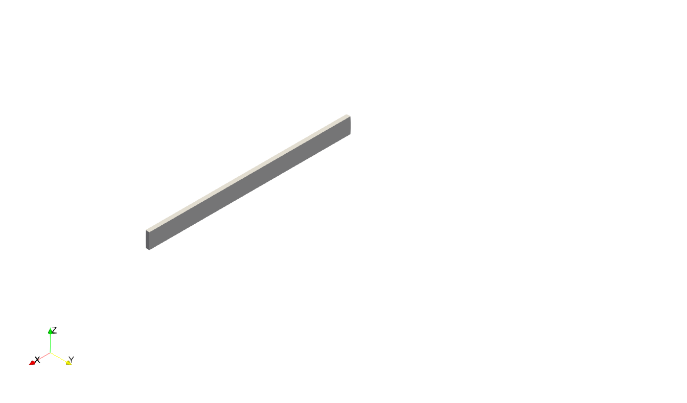
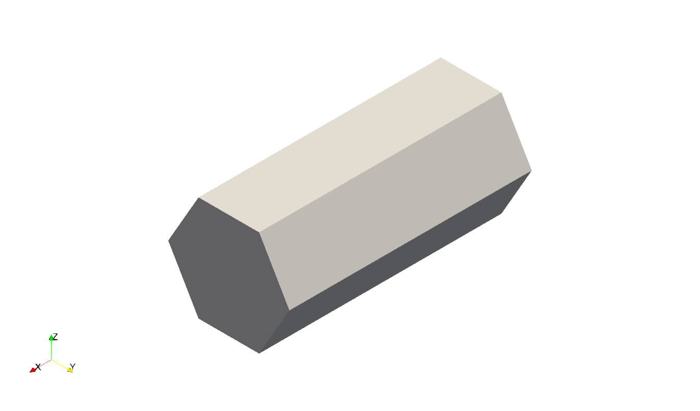
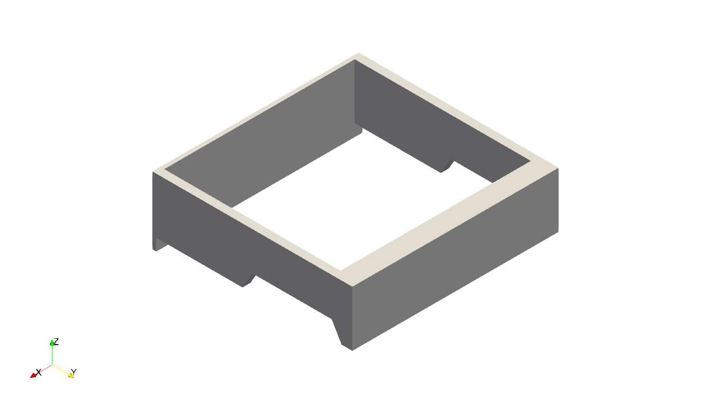

# doc_bolean

Boolean operations on/with STL meshes, utilizing a Docker image of [PyMesh](https://pymesh.readthedocs.io/en/latest/installation.html).

STLs placed in `./home/`. with the following naming convention(s):
- at least one file `msh_0_nul.stl`, followed by
- `msh_n_str.stl`, with `n` and integer and `str` a string of 3 characters, specifying an operation.

The operations are:
- `dif` : difference
- `uni` : union
- `int` : intersection
- `sym` : symmetric difference

See the PyMesh [documentation](https://pymesh.readthedocs.io/en/latest/mesh_boolean.html).

## Example
Consider for example the following files in the the `./home/` directory:
```
├──home
│   ├── msh_0_nul.stl
│   ├── msh_1_dif.stl
│   ├── msh_2_dif.stl
│   ├── msh_3_uni.stl
│   ├── msh_4_dif.stl
```
See Figure 1 to 5.

<p align="center" style="text-align: center; font-weight: bold;">

</p>
<p align="center" style="text-align: center; font-weight: bold;">
Figure 1: Input STL mesh 0 (msh_0_nul.stl).
</p>

<p align="center" style="text-align: center; font-weight: bold;">

</p>
<p align="center" style="text-align: center; font-weight: bold;">
Figure 2: Input STL mesh 1 (msh_1_dif.stl).
</p>

<p align="center" style="text-align: center; font-weight: bold;">

</p>
<p align="center" style="text-align: center; font-weight: bold;">
Figure 3: Input STL mesh 2 (msh_2_dif.stl).
</p>

<p align="center" style="text-align: center; font-weight: bold;">

</p>
<p align="center" style="text-align: center; font-weight: bold;">
Figure 4: Input STL mesh 3 (msh_3_uni.stl).
</p>

<p align="center" style="text-align: center; font-weight: bold;">

</p>
<p align="center" style="text-align: center; font-weight: bold;">
Figure 5: Input STL mesh 4 (msh_4_dif.stl).
</p>

Given the presence of these files, executing the script `/home/main.py`, should produce the output displayed in Figure 6.

<p align="center" style="text-align: center; font-weight: bold;">

</p>
<p align="center" style="text-align: center; font-weight: bold;">
Figure 5: Output STL mesh (output.stl).
</p>
